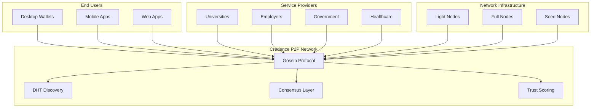

# Credence Deployment & Integration Guides

> **⚠️ IMPLEMENTATION STATUS**  
> These guides describe the target deployment experience for Credence. While the core services exist in the codebase, the **Docker containers, CI/CD pipelines, installers, and some SDKs** described here are not yet implemented. Download links and some deployment scripts represent the target state. This documentation serves as a specification for DevOps implementation.

Welcome to the Credence ecosystem! Choose your path based on your role and needs:

## 🔧 For Users

### [End User Wallet Guide](./end-user-wallet.md)
**Just want to use Credence?** Download the desktop wallet and start building your decentralized identity.

**Perfect for:**
- Individuals managing their digital identity
- Students receiving credentials
- Professionals building trust networks
- Anyone wanting privacy-first identity management

**No technical setup required** - just download and go!

---

## 🏗️ For Network Operators

### [Light Node Guide](./light-node.md)
**Want to help the network?** Run a light node to participate in P2P gossip and data availability.

**Perfect for:**
- Community members wanting to contribute
- Users with basic technical skills
- Those wanting modest rewards for network participation

**Requirements:** Basic VPS, 4GB RAM, Docker knowledge

### [Full Node Guide](./full-node.md)
**Serious about infrastructure?** Run a complete node with all Credence services for maximum rewards.

**Perfect for:**
- Organizations wanting full network participation
- Technical teams with DevOps experience
- Infrastructure providers seeking higher rewards

**Requirements:** Dedicated server, 16GB+ RAM, professional deployment

---

## 🏢 For Organizations

### [Service Provider Guide](./service-provider.md)
**Need to issue credentials?** Set up issuer services for your institution, company, or organization.

**Perfect for:**
- Universities issuing diplomas
- Companies providing employment verification
- Government agencies issuing licenses
- Healthcare providers managing certifications

**Custom solutions** for credential issuance, verification, and management.

---

## 👩‍💻 For Developers

### [Developer Integration Guide](./developer.md)
**Building applications?** Integrate Credence into your existing systems and applications.

**Perfect for:**
- Frontend/backend developers
- Mobile app developers
- Enterprise integration teams
- API consumers

**Comprehensive SDKs** for JavaScript, Go, Python, and more.

---

## 🚀 Quick Start Matrix

| Your Role | Time to Setup | Technical Level | Guide |
|-----------|---------------|----------------|--------|
| **End User** | 5 minutes | None | [Wallet Guide](./end-user-wallet.md) |
| **Light Node Operator** | 30 minutes | Basic | [Light Node](./light-node.md) |
| **Full Node Operator** | 2-4 hours | Advanced | [Full Node](./full-node.md) |
| **Credential Issuer** | 1-2 hours | Intermediate | [Service Provider](./service-provider.md) |
| **App Developer** | 30 minutes | Programming | [Developer Guide](./developer.md) |

## 💡 Architecture Overview

## 🎯 Use Case Examples

### Individual Users
- **Students**: Receive and manage academic credentials
- **Professionals**: Build verifiable work history
- **Citizens**: Store government-issued documents
- **Consumers**: Manage online reputation and trust

### Organizations
- **Educational Institutions**: Issue tamper-proof diplomas and certificates
- **Employers**: Provide verifiable employment history
- **Licensing Bodies**: Issue professional licenses and certifications
- **Healthcare Systems**: Manage vaccination records and medical licenses

### Developers
- **dApp Builders**: Add trust scoring to decentralized applications
- **Enterprise Teams**: Integrate credential verification into existing systems
- **Identity Providers**: Build on decentralized identity standards
- **Platform Creators**: Enable trust-based features in applications

## 🔒 Security & Privacy

All deployment patterns prioritize:
- **Privacy by Design** - Minimal data collection and sharing
- **Self-Sovereign Identity** - Users control their own data
- **Zero-Knowledge Proofs** - Verify without revealing unnecessary details
- **Decentralized Architecture** - No single point of failure or control

## 🌐 Network Effects

The more participants in each role, the stronger the network becomes:

- **More Users** → Higher demand for services → Better economics for operators
- **More Nodes** → Better redundancy → More reliable network
- **More Issuers** → Richer credential ecosystem → Higher utility
- **More Developers** → Better tooling → Easier adoption

## 🆘 Need Help?

1. **Start with the guide** that matches your role
2. **Join the community** at [discord.gg/credence](https://discord.gg/credence)
3. **Check the FAQ** at [credence.network/faq](https://credence.network/faq)
4. **Open an issue** at [github.com/ParichayaHQ/credence/issues](https://github.com/ParichayaHQ/credence/issues)

**Ready to get started?** Pick your guide above and dive in! 🌊